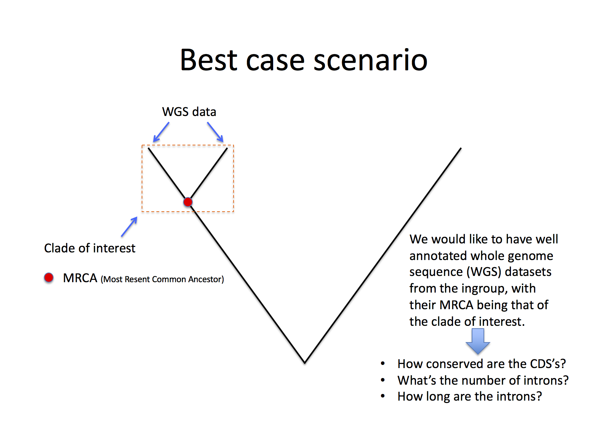
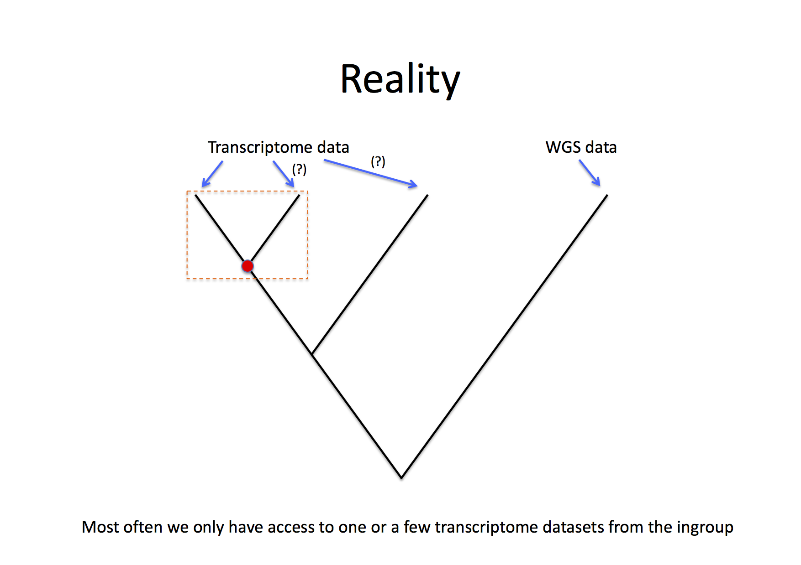
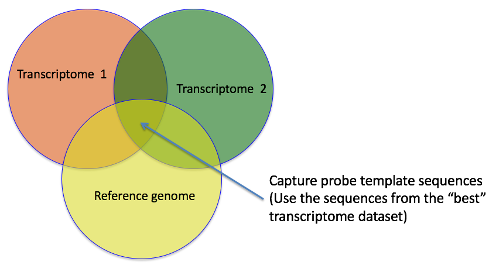

# Introduction
This repository describes a method for finding useful gene sequences to use for developing target capture (a.k.a. sequence capture) probes for DNA sequencing. The idea is that these probes will be general enough to capture DNA molecules from several different species, and that the sequences can be used for e.g. phylogenetic analysis of species from a family, order or a group at some other taxonomic level.

## The data
The first part of your analysis should be to familiarise yourself with the input data you'll use for designing the probes. I imagine you will have one or two transcriptome datasets from your ingroup and perhaps an annotated whole genome dataset from a related organism.


In this figure we see the phylogenetic relationship between the two species from where we have transcriptome data (Tr.1 and Tr.2) and one species with an annotated reference genome (or Whole Genome Sequence dataset [WGS]). The number of species from which WGS data is available is rather limited, but a species from the same family or order as your ingroup taxa will most likely be sufficient. 




## Basic work flow
A more comprehensive description of the steps involved in this analysis can be find in [Sequence_capture.pdf](./Sequence_capture.pdf). The aim of this type of analysis is to find transcriptome sequences that can be used to design capture probes. To that end, we identify transcriptome sequences (in practise the exon sequences of genes) that is conserved within a phylogenetic clade, and that hopefully contain intron sequences with enough phylogenetically informative sites that we will be able to resolve the relationships in out group of interest (here called the ingroup). Since the transcriptome data often originates from cDNA generated from mRNA, where the intron sequences have been spliced out, we don\'t know how many variable intron regions we can expect from just analysing the transcriptome data. However, the annotated reference genome will provide information on the gene models (UTR's, intron exons etc.) that can be incorporated in out analysis.


The area in the venn diagram where all three circles overlap indicates part of the sequence space (i.e. all available sequences) where the transcriptome sequences are conserved (and therefore similar) and the genes then originate from have the desired number of introns. How similar is enough and how many introns that are required is up to you to decide after the first iteration of this analysis. You will most likely want to go back an redo some steps in order to end up with a sufficient number of reference transcript to use as templates for your capture probes.

### 1. Identify low copy gene sequences in transcriptome 1
This part of the analysis is conducted using `BLAST` on the command line. How `BLAST` works is out of the scope of this tutorial, but I suggest you read up on the [on-line manual](https://www.ncbi.nlm.nih.gov/books/NBK279680/) before you start. An example command might looks like this:

```bash
blastn -query $INPUT -db $DB -max_target_seqs 2 -outfmt 7 -out $OUT -num_threads $NSLOTS
```
where `$INPUT` and `$DB` should be replaced with the input file in fasta format and a `BLAST` database of the same data (remember, you are blasting transcriptome 1 to itself). `$OUT` should indicate the name of the output file and $NSLOTS the number of CPU cores to use (the `-num_threads $NSLOTS` command is optional but can significantly speed up your analysis if you're analysing a large transcriptome and have a system with several CPU cores). Important to include is the command `-outfmt 7` which determines the output format for `BLAST`. Here we are using the tab-delimited format, which makes it easier to analyse the result afterwards. An example of what the output will look like can be found below:

```blast
# BLASTN 2.3.0+
# Query: scaffold-CKDK-2001401-Ochna_serrulata
# Database: Ochna_serrulata_transcriptome_300.fst
# Fields: query id, subject id, % identity, alignment length, mismatches, gap opens, q. start, q. end, s. start, s. end, evalue, bit score
# 1 hits found
scaffold-CKDK-2001401-Ochna_serrulata	scaffold-CKDK-2001401-Ochna_serrulata	100.000	300	0	0	1	300	1	300	9.42e-157	551
```

An example output file can also be found [here](example_data/transcriptome_to_self.BLASTn.txt). `BLAST` matches including the line `# 1 hits found` indicate sequences that (given the settings used for the `BLAST` search) did not have any good matches in the data set, except matches to them self. This is a good indication that these sequences are from single- or low copy genes, and hence what we are looking for. Later on we might want to consider other sequences with poor matches (also indications of low- single copy genes).

You can extract the interesting `BLAST` matches and save them in a new file like this:

```blast
grep -A1 "# 1 hits found" example_data/transcriptome_to_self.BLASTn.txt > low_copy_sequences.BLASTn.txt
```

The newly created file `low_copy_sequences.BLASTn.txt` now contains information about the blast matches of the low copy genes. We need to extract the sequence names for the next step, and we can do that like this:

```blast
cut -f1 low_copy_sequences.BLASTn.txt | grep -v "\-\-" | grep -v "#" > low_copy_names.txt
```
This command may look complicated, why I suggest you explore the manual pages for the included sub-commands to learn more (`man cut` and `man grep`).

We now have the names of the (presumed) low copy genes in transcriptome 1 stored in the file `low_copy_names.txt`. We can use this file to extract the DNA sequences using the program `fp.py` available for download [here](https://github.com/topel-research-group/misc).

```blast
fp.py --grep low_copy_names.txt example_data/Ochna_serrulata_q1000_a500_GO400_e80_final_selection_for_baits.fst > low_copy_sequences.fst
```
The extracted sequences are automatically saved to the file `low_copy_sequences.fst`, and the first part of the analysis is finished. It's important to continuously examine the content of the output files in each step, to make sure your commands produce the expected output, and that you find a sufficient amount of low copy sequences.


## 2. Find the homologous sequences in transcriptome 2


3. [Optional] Extract gene structure data from a WGS dataset (number of exons, length of introns, copy number,…)


