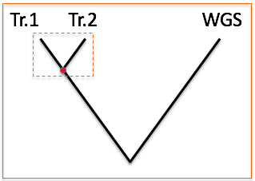

# Introduction
This repository describes a method for finding useful gene sequences to use for developing target capture (a.k.a. sequence capture) probes for DNA sequencing. The idea is that these probes will be general enough to capture DNA molecules from several different species, and that the sequences can be used for e.g. phylogenetic analysis of species from a family, order or a group at some other taxonomic level.

## The data
The first part of your analysis should be to familiarise yourself with the input data you'll use for designing the probes. I imagine you will have one or two transcriptome datasets from your ingroup and perhaps an annotated whole genome dataset from a related organism.

## Basic work flow
A more comprehensive description of the steps involved in this analysis can be find in [Sequence_capture.pdf](./Sequence_capture.pdf).

1. Identify low copy gene sequences in transcriptome 1
2. Find the homologous sequences in transcriptome 2
3. [Optional] Extract gene structure data from a WGS dataset (number of exons, length of introns, copy number,…)

